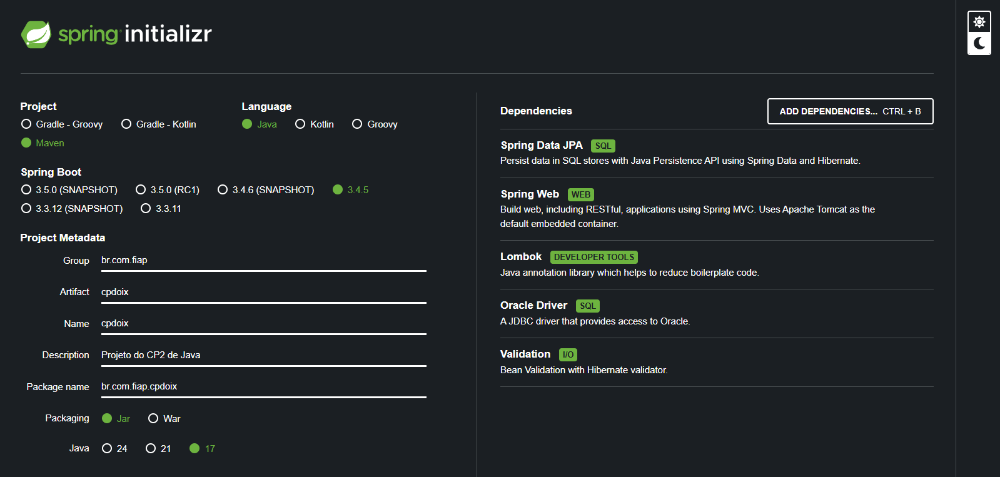

# Checkpoint 2 - API REST

## Integrantes do Grupo

| Nome                    |   RM   |
|:------------------------|:------:|
| Otavio Miklos Nogueira  | 554513 |
| Luciayla Yumi Kawakami  | 557987 |
| Tiago Ribeiro Capela    | 558021 |
| Raphaela Oliveira Tatto | 554983 |

---

## Descrição do Projeto

Este projeto é uma API REST que se comunica com o Oracle DB e disponibilza endpoints para o controle da tabela de brinquedos

---

## Configuração do Projeto

### 1. Requisitos

- Java Development Kit (JDK) 17 ou superior
- Maven
- Banco de dados Oracle acessível
- IDE (IntelliJ IDEA, Eclipse, etc.)

### 2. Configuração do Banco de Dados

Dentro da pasta `resources`, atualize o arquivo `application.properties` com suas credenciais:

```properties
spring.datasource.url=jdbc:oracle:thin:@oracle.fiap.com.br:1521:orcl
spring.datasource.username=[seu_login]
spring.datasource.password=[sua_senha]
spring.datasource.driver-class-name=oracle.jdbc.OracleDriver
spring.jpa.hibernate.ddl-auto=update
```

### 3. Spring Initializr



### 4. Dependências Maven `pom.xml`

```xml
<dependencies>

    <!-- Spring -->
    <dependency>
        <groupId>org.springframework.boot</groupId>
        <artifactId>spring-boot-starter-data-jpa</artifactId>
    </dependency>

    <dependency>
        <groupId>org.springframework.boot</groupId>
        <artifactId>spring-boot-starter-validation</artifactId>
    </dependency>

    <dependency>
        <groupId>org.springframework.boot</groupId>
        <artifactId>spring-boot-starter-web</artifactId>
    </dependency>

    <dependency>
        <groupId>org.springframework.boot</groupId>
        <artifactId>spring-boot-starter-test</artifactId>
        <scope>test</scope>
    </dependency>

    <!-- Driver JDBC Oracle -->
    <dependency>
        <groupId>com.oracle.database.jdbc</groupId>
        <artifactId>ojdbc11</artifactId>
        <scope>runtime</scope>
    </dependency>

    <!-- Lombok -->
    <dependency>
        <groupId>org.projectlombok</groupId>
        <artifactId>lombok</artifactId>
        <optional>true</optional>
    </dependency>
</dependencies>
```

### 5. Build Maven `pom.xml`

```xml
<build>
    <plugins>
        <plugin>
            <groupId>org.apache.maven.plugins</groupId>
            <artifactId>maven-compiler-plugin</artifactId>
            <configuration>
                <annotationProcessorPaths>
                    <path>
                        <groupId>org.projectlombok</groupId>
                        <artifactId>lombok</artifactId>
                    </path>
                </annotationProcessorPaths>
            </configuration>
        </plugin>

        <plugin>
            <groupId>org.springframework.boot</groupId>
            <artifactId>spring-boot-maven-plugin</artifactId>
            <configuration>
                <excludes>
                    <exclude>
                        <groupId>org.projectlombok</groupId>
                        <artifactId>lombok</artifactId>
                    </exclude>
                </excludes>
            </configuration>
        </plugin>
    </plugins>
</build>
```

### 6. Importação do Projeto

- Importe o projeto para sua IDE.
- Certifique-se de que as dependências do Maven estão resolvidas corretamente.

---

## Explicação do Código

### Entities

- `Toy`: Classe base de brinquedos, serve como um espelho da tabela `TAB_TOY` para o banco de dados, com seus atributos e validações necessárias

### Enums

- `ToyClassification`: Classificações pré-definidas que a classe `Toy` pode ter
- `ToySize`: Tamanhos pré-definidos que a classe `Toy` pode ter

### DTOs

- `ToyReq`: Faz a validação das requisições que vêm da web, para que ela seja mapeada para uma instância de `Toy`
- `ToyRes`: É a resposta que um usuário recebe com as informações necessárias do `Toy`

### Services

- `ToyService`: Faz o mapeamento de `ToyReq` para `Toy` e o mapeamento de `Toy` para `ToyRes`

### Repositories

- `ToyRepository`: Responsável por fazer a ligação entre um repositório comum e a classe `Toy`
  
### Controllers

- `ToyController`: Aqui é onde toda a mágica acontece, rotas com métodos HTTP e acesso ao `ToyRepository` para fazer a comunicação propriamente dita com o banco de dados da Oracle

### Exceptions

- `ValidationExceptionHandler`: Caso algum erro ocorra na hora de mapear um `ToyReq` para um `Toy`, esse cara entra em ação e devolve uma resposta com o erro para o usuário

## Rotas HTTP

URL Base -> **localhost:8080**

| Método | Rota                                             | Descrição                                               |
|--------|--------------------------------------------------|---------------------------------------------------------|
| POST   | [/brinquedos](localhost:8080/brinquedos)         | Cria uma nova instância de brinquedo                    |
| GET    | [/brinquedos](localhost:8080/brinquedos)         | Retorna todos os brinquedos guardados no banco de dados |
| GET    | [/brinquedos/{id}](localhost:8080/brinquedos/10) | Retorna o brinquedo com o id fornecido                  |
| PUT    | [/brinquedos/{id}](localhost:8080/brinquedos/10) | Atualiza o brinquedo com o id fornecido                 |
| DELETE | [/brinquedos/{id}](localhost:8080/brinquedos/10) | Delete o brinquedo com o id fornecido                   |

### JSON de um brinquedo

```javascript
{
    "name": string,
    "type": string,
    "classification": "FREE" | "ADULT" | "TEEN" | "CHILD",
    "size": "SMALL" | "MEDIUM" | "LARGE",
    "price": number
}
```

### Exemplo

```json
{
    "name": "Sr Batatão",
    "type": "Boneco",
    "classification": "FREE",
    "size": "SMALL",
    "price": 8.90
}
```
